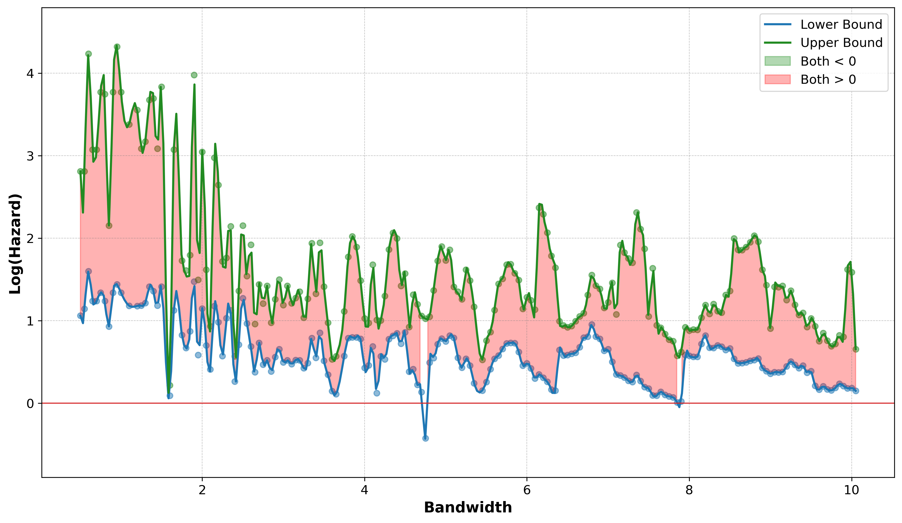
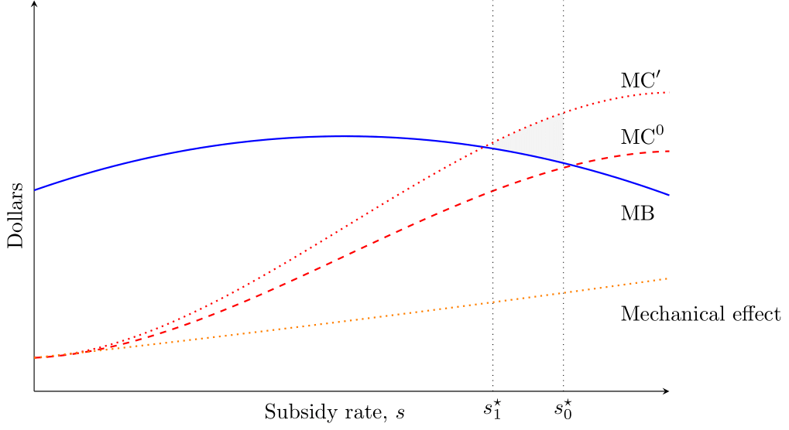

I am a Ph.D. Candidate in Economics at the University of Virginia. My research focuses on public and health economics, with an emphasis on the design and impact of U.S. nutrition assistance programs. 

You can contact me at [pa7kd@virginia.edu](mailto:pa7kd@virginia.edu).

---

## Working Papers

  <h3 style="margin-top: 0;"><strong>The Causal Effect of WIC on Breastfeeding: A Partial Identification Approach with Regression Discontinuity</strong></h3>
  

    The World Health Organization and the American Academy of Pediatrics recommend breastfeeding for infant feeding, and breastfeeding is associated with reduced risk of diabetes for mothers and childhood obesity for infants, among other positive health outcomes. Breastfeeding promotion and support is a core service of the Special Supplemental Nutrition Program for Women, Infants, and Children (WIC), which serves 50% of infants in the United States; however, program benefits include quantity vouchers for infant formula, encouraging substitution away from breastfeeding among participating mothers. Exploiting the program's income eligibility standards as the discontinuity threshold, we combine partial identification assumptions and a fuzzy regression discontinuity design that identifies the local average treatment effect (LATE) on the proportion of women initiating breastfeeding and the duration of breastfeeding. Using data from the Pregnancy Risk Assessment Monitoring System (PRAMS), we find that participation in WIC reduces the percentage of women initiating breastfeeding and increases the probability of early breastfeeding cessation.
  

  

    <h3 style="margin-top: 0;"><strong>Targeting with Quality Differentiated In-Kind Transfers: Evidence from WIC</strong></h3>
    

      The in-kind provision of public benefits restricts recipient choice but potentially enhances targeting. We extend the approach of Lieber and Lockwood (2019) to analyze this tradeoff when transferred benefits differ in quality from available alternatives, introducing indirect costs. We use this framework to study the in-kind transfer of infant formula by the Special Supplemental Nutrition Program for Women, Infants, and Children (WIC), which serves approximately half of U.S. infants. Using the 2009 WIC Food Package Revision as an instrumental variable, we find that each additional week of exclusive breastfeeding significantly reduces childhood obesity risk and improves growth trajectories through age five. Although the in-kind provision of formula effectively targets a subset of eligible participants with potentially higher marginal utility, the quality differential between formula and breastfeeding generates substantial indirect healthcare costs. Under standard modeling assumptions, these indirect costs significantly reduce the optimal formula subsidy rate.
    

    

## Works in Progress

  <h3 style="margin-top: 0;"><strong>Intensive Margin Welfare Implications: Evidence from WIC EBT</strong></h3>

